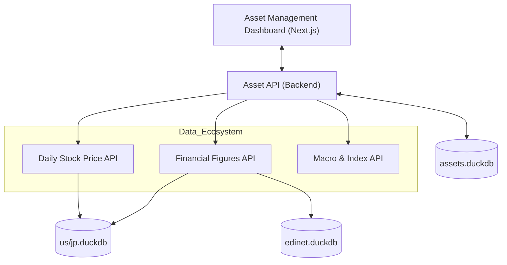

# Architecture & Design Philosophy

This document outlines the core problems, architectural decisions, and constraints of the Ayato Finance Ecosystem.

## 1. Problem Definition
Professional-grade financial analysis typically faces three hurdles:
- **Data Fragmentation**: Prices, financial statements, and macro indicators are scattered across multiple APIs and vendors.
- **Cloud Dependency & Latency**: Most platforms require expensive cloud databases and persistent internet connections, resulting in high latency for complex analytical joins.
- **Complexity of Integration**: Building a unified view of a portfolio (including "Shadow Benchmarking") requires complex, cross-domain logic that is hard to maintain in monolithic apps.

## 2. Design Decisions

### Local-First Persistence (DuckDB + Parquet)
We chose **DuckDB** as our core analytical engine.
- **Reasoning**: It provides SQL-level power with zero-latency local execution. By storing data in Parquet-backed DuckDB files, we eliminate network overhead for analytical queries (e.g., calculating Sharpe ratios across thousands of tickers).

### Decoupled Microservices
The ecosystem is split into domain-specific APIs (Stock Price, Financial Figures, Macro, etc.).
- **Reasoning**: This allows for independent ingestion schedules and failure isolation. A failure in the Crypto price fetcher does not halt the analysis of Statutory Financials.

### Monorepo Strategy
We maintain all services in a single repository.
- **Reasoning**: Shared logic (like the `Mapping Audit` system for Japanese stocks) can be synchronized instantly across all modules, ensuring data consistency without managing multiple upstream packages.

## 3. Overall System Diagram

## 4. Constraints and Limits
To maintain trust, we explicitly state what this system is **not** designed for:
- **Not for Real-Time Scalping**: This system is optimized for "Local-First" analysis and batch ingestion. It is not a low-latency HFT execution engine.
- **No Native Multi-User Sync**: By design, databases are local files. Multi-user collaboration requires a centralized shared file system or a dedicated SQL server wrapper (not included).
- **Memory Bound**: Large-scale analytical joins across millions of rows (e.g., US market history) depend on local RAM. Performance scales with your hardware.
- **Manual Mapping Requirement**: Japanese stock data (EDINET/J-Quants) requires custom mapping logic due to non-standardized XBRL tags.

---
*By defining these limits, we ensure that users and commercial partners apply the ecosystem to the right problems.*
