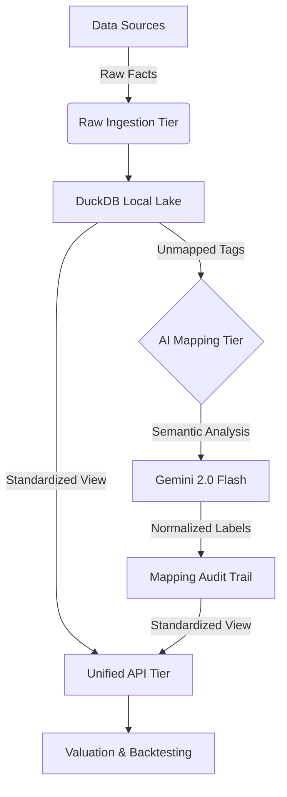

# Financial Figures: Unified AI Financial Data Lake 💹

A production-grade, traceability-first financial data pipeline designed to unify fragmented global market data (SEC for US, J-Quants for JP) into a high-precision, standardized analytical engine.

## 🚀 Mission

To eliminate the "Semantic Gap" in financial analysis by transforming idiosyncratic, market-specific reporting tags into a unified set of standardized metrics using AI-driven mapping and resilient data engineering.

このシステムの責任の範囲は財務数値データのデータベースの差分更新ロジックとAPIによる提供です。分析はAPIからこのデータベースにアクセスした別のシステムの責任です。

---

## 🏗 Architecture Overview

The system operates on a 3-tier "Normalizing Pipeline" architecture:



### 1. Raw Ingestion Tier
- **US Market**: Parallel ingestion from SEC CompanyFacts API (50,000+ facts per batch).
- **JP Market**: Integration with J-Quants V2 API for Japanese Listed Companies.
- **Resilience**: Singleton executor pattern to prevent blocking on deadlocked network calls.

### 2. AI Mapping Tier (Standardization)
- **Standardized Labels**: Normalizes thousands of raw tags (e.g., `NetSales`, `SalesRevenueNet`, `売上高`) into a single `NetSales` label.
- **Mapping Audit (Provenance)**: Every mapping decision is logged with AI reasoning, model version, and confidence score in `traceability.duckdb`.

### 3. Unified API Tier
- **Cross-Market SQL**: Provides a unified view `v_standardized_financials` that joins facts across US/JP markets regardless of origin.
- **Price Resolution**: Robust `PriceResolver` handles schema variations (e.g., `close` vs `Close`) in Parquet historical data.

---

## 📊 Standardized Metric Catalog

The system targets high-utilization financial metrics for valuation:

| Target Label | Description | Calculation Use Case |
| :--- | :--- | :--- |
| **NetSales** | Top-line revenue from core activities | Margin analysis, P/S ratio |
| **OperatingProfit**| Profit after operating expenses | Operational efficiency (EBIT) |
| **NetProfit** | Bottom-line profit attributable to parent | ROE, ROA, Net Margin |
| **EPS** | Earnings Per Share (Standardized) | PER (P/E Ratio) |
| **TotalAssets** | Aggregate resource value | Asset turnover, Leverage |
| **Equity** | Total shareholders' equity | PBR (P/B Ratio), ROE |

---

## 🛡 Resilience Features

- **Price Normalization**: DuckDB-powered case-insensitive column projection ensures that pricing queries never fail due to upstream schema changes.
- **Autonomous Recovery**: Batch-splitting logic automatically recovers mapping sessions from 429 Rate Limits or network hangups.
- **Traceability First**: Complete audit trail for AI mappings ensures explainability—critical for institutional-grade financial modeling.

---

## 🛠 Setup & Usage

### Prerequisites
- Python 3.10+
- `uv` (Fastest Python package manager)
- Gemini API Key & J-Quants API Key

### Installation
```bash
# Clone the repository
git clone [repo-url]
cd "Financial Figures"

# Install dependencies
uv pip install -e .
```

### Operations (Windows Batch Files)

For ease of use on Windows, the following batch files are provided in the root directory. Choose the one that fits your current task:

| File | Mode | Description |
| :--- | :--- | :--- |
| **`run.bat`** | **Main Menu** | **Recommended.** An interactive menu that allows you to select any of the operations below. |
| **`run_sync.bat`** | **Daily Sync** | Performs an incremental sync for US, JP, and EDINET data. Use this for daily maintenance. |
| **`run_server.bat`** | **Viewer Mode** | Starts the API server (Port 5006) in **read-only mode**. Safe for parallel use with sync tasks. |
| **`run_full_backfill.bat`** | **Historical** | Performs a full 5-year historical backfill for EDINET data. **High token consumption.** |

#### Manual Execution (Advanced)
If you prefer using the CLI directly:
```powershell
# Sync Market Data (Incremental)
uv run python main.py --sync-market all --incremental

# Start API Server
uv run python main.py --api --port 5006
```

---

## 📁 Directory Structure
- `src/api`: FastAPI endpoints and standardized SQL views.
- `src/engines`: Market-specific data fetchers (SEC/J-Quants).
- `src/mappers`: AI Mapping logic and LLM orchestration.
- `src/services`: Batch synchronization services.
- `data/`: Local DuckDB lake (US, JP, and Traceability databases).

---

## ⚖️ License

This project is licensed under a **Dual License** model to support both open-source community innovation and commercial sustainability:

- **Open Source License**: Licensed under the [GNU Affero General Public License v3.0 (AGPL-3.0)](LICENSE). This ensures that any improvements to the core engine are shared back with the community.
- **Commercial License**: For organizations that wish to use this software in proprietary products or environments without AGPL obligations, separate commercial licenses are available. 

For inquiries regarding commercial licensing, please contact: [support@ayato.studio](mailto:support@ayato.studio)

---

## 🤝 Contributing

We welcome contributions! To maintain the sustainability of the project, all contributors must agree to our [Contributor License Agreement (CLA)](CLA.md).

1. **Agree to the CLA**: In your Pull Request description, please include:
   > "I agree to the CLA of Ayato Finance Ecosystem as defined in CLA.md."
2. **Follow the Standards**: Ensure your code passes all linting (`ruff`) and tests before submission.

Please see [CONTRIBUTING.md](CONTRIBUTING.md) for more details.
