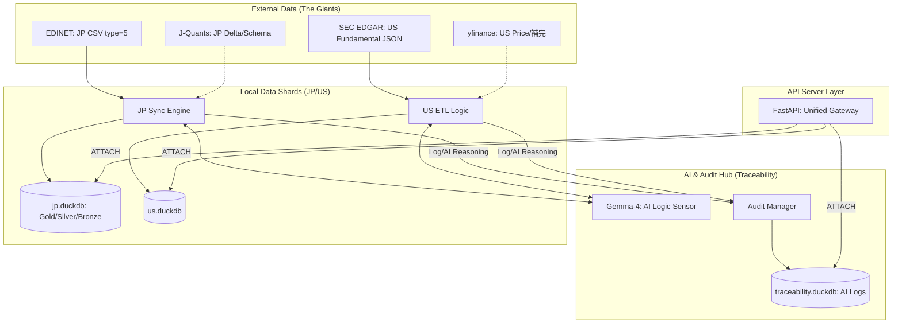

# ローカル財務データベース API サーバー 要件定義書 (概要)

**文書種別:** 概念レベル要件定義 (全体像と設計思想)  
**対象市場:** 日本市場・米国市場 (全上場銘柄)  
**運用形態:** ローカル環境での完結動作 (常時無料ツールのみ)
**使用するLLM:** JSON モードを使用。`GOOGLE_AI_MODELS = ["gemma-4-31b-it", "gemma-4-26b-a4b-it"]`

---

## 1. 設計思想

本システムは以下の 6 原則を最優先とし、**「エンジニアの工数」と「ランニングコスト」を極限まで削減**した持続可能な財務 DB を目指す。

1. **外部有料 API への依存ゼロ**: 常時無料ツールおよび API の無料枠のみで完結させる。
2. **ローカル完結**: 全てのデータを手元の DuckDB に集約する。
3. **差分更新による低運用負荷**: 毎回全量取得せず、未取得分のみを効率的に継ぎ足す。
4. **トレーサビリティ・ファースト**: 数値の出生証明 (Provenance) と AI のマッピング根拠 (Reasoning) を全レコードに刻印する。
5. **巨人の肩に乗る**: 公式の変換済みデータ (CSV/JSON) を優先し、XBRL 解析などの車輪の再開発を徹底排除する。
6. **Schema-as-Code と データ契約**: スキーマは `schema.py` で一元管理し、Pydantic による厳密な検証を強制する。

---

## 2. 詳細設計ドキュメント

詳細な仕様については、以下の各ドキュメントを参照すること。

- [**データソース定義**](設計/データソース定義.md) : 市場別の取得戦略、制約、銘柄ユニバース管理。
- [**ストレージとスキーマ**](設計/ストレージとスキーマ.md) : DuckDB 物理分割、3階層構造、ロック競合対策。
- [**データベーススキーマ定義**](設計/データベーススキーマ定義.md) : テーブル構造、データ型、インデックスの詳細。(`src/core/schema.py` より自動生成)
- [**同期プロセス**](設計/同期プロセス.md) : 差分更新アルゴリズム、プロバイダー隔離パターン。
- [**並列同期アーキテクチャ設計**](設計/並列同期アーキテクチャ設計.md) : 書き込みロックの解消とスループット向上の設計。
- [**EDINETタグ処理仕様**](設計/EDINETタグ処理仕様.md) : 法定開示情報のパースと標準化の流れ。
- [**APIと証跡管理**](設計/APIと証跡管理.md) : FastAPI 仕様、監査方針、非機能要件。

---

## 3. システム境界 (やらないこと)

| 項目 | 方針 | 理由 |
|---|---|---|
| **物理レベルの統合** | やらない。 | 各国の会計基準の差異を無視して物理的に統合するとデータが劣化するため。 |
| **手動辞書管理** | やらない。 | 項目紐付けは AI による動的推論に任せ、メンテナンス・フリーを実現する。 |
| **株価・ニュース** | 対象外。 | 本システムは財務数値（BS/PL/CF）の蓄積に特化する。 |

---

## 4. システム構成図

---

## 5. 将来拡張候補

- **AIマッピングの精度改善 ([市場+業種+タグ] 化)**
- **欧州・アジア市場対応** (新しい DuckDB Shard と ETL モジュールの追加)
- **財務数値の訂正対応 (完全版)**
- **生成 AI による財務分析エンドポイントの追加**
