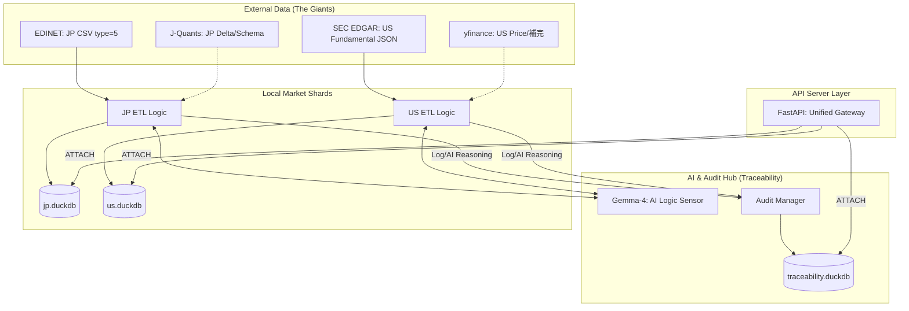

# ローカル財務データベース API サーバー 要件定義書

**文書種別:** 概念レベル要件定義(何を何で実装するか / しないか)  
**対象市場:** 日本市場・米国市場(全上場銘柄)  
**データ種別:** 財務数値データのみ(10年以上)  
**運用形態:** ローカル環境での完結動作(常時無料ツールのみ)

---

## 1. 設計思想

本システムは以下の 4 原則を最優先とし、**「エンジニアの工数」と「ランニングコスト」を極限まで削減**した持続可能な財務 DB を目指す。

1. **外部有料 API への依存ゼロ**: 常時無料ツールおよび API の無料枠のみで完結させる。
2. **ローカル完結**: プライバシーとパフォーマンスのため、全てのデータを手元の DuckDB に集約する。
3. **差分更新による低運用負荷**: 毎回全量取得せず、未取得分のみを効率的に継ぎ足す。
4. **トレーサビリティ・ファースト(証跡の最優先)**: 
    - 開発段階では実行速度よりデータの追跡可能性を優先し、数値の出生証明(Provenance)を全レコードに刻印する。
    - AI のマッピング根拠(Reasoning)をテキストとして保存し、ブラックボックス化を防ぐ。
5. **巨人の肩に乗る(既存資産の最大活用)**: 
    - **API 活用**: 金融庁の CSV 変換 (type=5) や SEC の JSON 配信を信じ、車輪の再開発(XBRL パース等)を徹底排除する。**XBRL 解析はタクソノミ更新の追従コストが極めて高いため、公式の変換済みデータを優先する。**
    - **AI 活用**: 論理のハードコードを避け、LLM を「動的ロジックセンサー」としてマッピング処理に導入する。

実装の詳細より、**どのレイヤーに何の責務を持たせるか** の概念的決定を本書で確定させる。

---

### 2.1 日本市場(戦略 A: ハイブリッド方式)

| 決定 | 内容 | 理由 |
|---|---|---|
| **使う** | EDINET API(金融庁) | **過去10年以上のバルク取得用。** `type=5` (CSV形式) を活用し、金融庁による変換済みデータを取得する。 |
| **使う** | J-Quants API(無料プラン V2) | **直近2年間の差分更新用。** JSON 形式で成形済みデータを取得し、日次運用のコストを抑える。 |
| **使う** | `requests` / `httpx` による直接 HTTP コール | ラッパーライブラリを排除し、API キー認証とダウンロード処理を直接制御する。 |
| **使わない** | 有料の J-Quants プラン(Standard 以上) | 実装コストと運用コストを天秤にかけ、EDINET CSV との併用で代替する。 |
| **使わない** | スクレイピング(Yahoo!ファイナンス JP 等) | 公式の構造化データ(CSV/JSON)が存在する限り、非推奨とする。 |

**日本市場データの制約と対応方針:**
- **J-Quants 無料プランの制限**: 財務データは「12週間前〜2年12週間前まで」に限定されるため、最新決算は EDINET 側で補完する。
- **データベースの物理分離**: J-Quants データは `jp.duckdb`、EDINET 統計データは `edinet.duckdb` にそれぞれ独立して格納し、データの出所を物理レベルで隔離する。
- **4桁コード標準化**: 日本株のティッカーコードは J-Quants (5桁) と EDINET (5桁) で表記が揺れるため、システム内部および DB 格納時は一律 4 桁(例: `7203`)に正規化して管理する。
- **CSV 優先戦略(リーン・プロトタイプ)**: EDINET API の `type=5` を指定し、XBRL を CSV に変換したものを取得対象とする。これにより、**XBRL 解析エンジンの自作と、頻繁なタクソノミ更新への対応コストを完全に回避する。**
- **欠損への対応**: 一部の古い報告書などで CSV が提供されていない (`csvFlag="0"`) 場合は、プロトタイプ段階では「取得対象外」としてスキップを許容する。

---

### 2.2 米国市場(戦略 D: 公式 API 優先方式)

| 決定 | 内容 | 理由 |
|---|---|---|
| **使う** | **SEC EDGAR API** | **財務数値(10-K/10-Q)のメインソース。** SEC 公式の RESTful API を通じて、クリーンな JSON 形式で 10 年分を取得可能。 |
| **使う** | `yfinance` | **株価(OHLCV)およびメタデータの補完用。** EDGAR が提供しない価格データの取得に限定して利用する。 |
| **使わない** | `yfinance` による財務数値取得 | 非公式スクレイピングへの依存を減らし、「砂上の楼閣」リスクを回避するため。 |
| **使わない** | SEC EDGAR の XBRL 直接パース | SEC が提供する `companyfacts` API (JSON) が既に正規化されているため、パースエンジンの自作は不要。 |

**米国市場データの制約と対応方針:**
- **CIK マッピング**: 米国株はティッカーではなく CIK(中央指数キー)で管理される。初回取得時にティッカーから CIK への変換テーブルを構築する。
- **データ遅延**: 日本株(J-Quants Free)同様、リアルタイム性は追わず、確定した過去データの蓄積に注力する。

---

### 3.1 物理・論理 2 階層スキーマ方針

データの「忠実性」と分析の「利便性」を両立するため、以下の 2 階層構造を採用する。

| 階層 | 格納形式 | 目的 |
|---|---|---|
| **物理保存層 (Physical)** | **市場別・ソース別 sharding** | **【情報の純度 100% 保持】**   JP (Primary): `jp.duckdb` (J-Quants 形式)  JP (Secondary): `edinet.duckdb` (EDINET 形式)  US: `us.duckdb` (SEC EDGAR 形式) |
| **論理変換層 (Logical)** | **共通標準インターフェース** | **【マルチ DB 透過的アクセス】**   1. 原則として J-Quants の成形済みデータを優先的に取得。  2. J-Quants に存在しない期間や項目についてのみ、EDINET DB から補完的に取得。 |

### 3.3 設計・研究の対象外(やらないこと)

| 項目 | 方針 |
|---|---|
| **物理レベルの完全な単一スキーマ化** | **やらない。** 各国の会計基準の差異を無視して物理的に統合するとデータが劣化するため、物理層はネイティブを維持する。 |
| **手動のマッピング辞書管理** | **やらない。** 市場間の項目の紐付けは AI (Gemma 等) による動的推論に任せ、メンテナンス・フリーを実現する。 |
| **XBRL パースエンジンの自作** | **やらない。** 各国の公式 API が配信する構造化データ (CSV/JSON) を盲信して利用する。 |
| **理由** | これらは「情報劣化」と「運用コスト増」を招くため、物理的な個別性と論理的な共通性を分離する。 |

| **対象外の勘定科目** | 企業独自の独自勘定科目は原則として対象外とし、J-Quants が定義する標準的な英語冗長ラベル(Redundant Labels)に基づく項目に絞り込む。 |

### 3.2 取得しないデータ

| 非対象 | 理由 |
|---|---|
| 株価・出来高データ | 本システムのスコープ外(財務数値専用) |
| ニュース・テキストデータ | 財務数値 DB の目的に含まれない |
| アナリスト予想・コンセンサス | 有料情報のため取得手段なし |
| 配当・株式分割データ | 財務数値 DB の主眼ではない(拡張要件として将来対応) |
| リアルタイムデータ | 財務諸表の性質上不要(年次・四半期単位) |

---

## 4. ストレージレイヤー

| 決定 | 内容 | 理由 |
|---|---|---|
| **使う** | DuckDB(物理 sharding) | 市場・ソースごとに DB ファイル (`jp.duckdb`, `edinet.duckdb`, `us.duckdb`) を分割。 |
| **使う** | **独立した監査 DB (`traceability.duckdb`)** | **【関心の分離】** 財務数値とシステム証跡(ログ・AI推論)を物理的に隔離し、証跡汚染を防ぐ。 |
| **使う** | DuckDB `ATTACH DATABASE` | API サーバー層で財務 DB と監査 DB を動的に結合し、分析と監査を両立させる。 |
| **使う** | Parquet (Backup) | 最終出力および中間キャッシュとして Parquet を利用。 |
| **使う** | **指数バックオフによるロック待機** | **【Windows環境耐性】** ファイルロック競合時、指数バックオフにより自律的に復旧する。 |

### 4.1 読み書き競合(Concurrency)への対応方針

Windows 環境下での DuckDB の厳格なファイルロックに対し、以下の多重防御策で「API 閲覧中のバックグラウンド同期」を実現する。

| 対策 | 内容 | 目的 |
|---|---|---|
| **短時間接続 (Short-lived)** | API サーバーはリクエストごとに接続・クエリ・切断を行い、接続を保持しない。 | 同期スクリプト(Writer)がロックを取得できる時間を確保する。 |
| **自動リトライ (Backoff)** | API/同期の両レイヤーで、ロックエラー検知時に指数バックオフによる再試行を行う。 | 瞬間的な競合をユーザーに意識させず、自律的に解消する。 |
| **接続モードの明示** | API サーバーは `read_only=True` を強制し、同期スクリプトは `read_only=False` で動作する。 | DuckDB の 1-Writer/N-Readers モデルをプロセス跨ぎで安全に運用する。 |
| **503 縮退運転** | リトライ上限を超えた場合、サーバーダウンを避け「一時的ビジー」として応答する。 | システム全体のクラッシュを防止し、可用性を維持する。 |

---

## 5. 差分更新ロジックレイヤー

本システムの核心概念。毎回全量再取得しないことで、API レート制限・実行時間・コストを最小化する。

### 5.1 差分判定・AI マッピングの方式(Hybrid)

| 決定 | 内容 |
|---|---|
| **Native Storage** | SEC EDGAR 等の生タグ(`NetIncomeLoss` 等)をそのまま物理 DB に保存。 |
| **Common Interface (Logical)** | 共通項目(売上高、純利益等)については、AI (Gemma) が「この生タグはどの標準項目に対応するか」を判定し、マッピング・ビューを生成。 |
| **Mapping Cache** | AI の推論結果は監査 DB の `mapping_audit` に永続化し、分析時の変換を高速化・固定化する。 |
| **Task-level Retry** | 書き込み失敗時、タスクをキューの最後尾に戻すことで、一時的な DB 負荷やロックによるデータ欠落を完全に防止する。 |
| **docID / CIK ポリング** | 提出書類の一覧を監視し、未登録分のみを取得する。 |

### 5.2 差分更新で使わない方式

| 非採用 | 理由 |
|---|---|
| 全量削除 → 全量再挿入(TRUNCATE & INSERT) | API 負荷が高くレート制限に抵触する |
| ハッシュ比較による行レベル変更検出 | 財務数値の訂正(修正開示)への対応として将来検討するが、初期実装では過剰 |
| CDC(Change Data Capture) | ソース側が CDC 非対応 |

---

## 6. API サーバーレイヤー

| 決定 | 内容 | 理由 |
|---|---|---|
| **使う** | FastAPI(Python) | 型安全、自動ドキュメント生成(Swagger UI)、非同期対応、軽量 |
| **使う** | DuckDB の Python クライアントを FastAPI から直接呼び出す | ORM を挟まず SQL で直接操作することでパフォーマンスを確保 |
| **使わない** | Django REST Framework | オーバースペック。管理画面・ORM・ミドルウェアが不要 |
| **使わない** | Flask | FastAPI に比べて型・ドキュメント自動生成が劣る |
| **使わない** | GraphQL | 財務数値 DB の用途に対してクエリ言語として過剰 |
| **使わない** | 認証・認可機能 | ローカル運用前提のため不要(外部公開時は別途検討) |
| **使わない** | ORM(SQLAlchemy 等) | DuckDB は ORM サポートが不完全かつカラム指向の特性を活かせないため SQL 直書きを採用 |

---

## 7. スケジューリング・バッチ実行レイヤー

| 決定 | 内容 | 理由 |
|---|---|---|
| **使う** | `APScheduler`(Python内スケジューラ) または OS の `cron` | シンプルなローカル定期実行に最適。外部依存なし |
| **使わない** | Celery + Redis / RabbitMQ | ローカル単一プロセスに対してキューブローカーは過剰 |
| **使わない** | Airflow / Prefect / Dagster | ワークフローオーケストレーションはスケールに対して過剰 |
| **使わない** | クラウドスケジューラ(Cloud Scheduler, Lambda 等) | ローカル完結要件に反する |

---

## 8. 銘柄ユニバース管理

| 決定 | 内容 | 理由 |
|---|---|---|
| **使う(日本)** | J-Quants の銘柄マスタ API | 東証全上場銘柄の正規リストを無料で取得可能 |
| **使う(米国)** | Wikipedia の S&P500 構成銘柄テーブル / GitHub 上のフリー CSV(例:github.com/datasets/s-and-p-500-companies) | yfinance 単独では全銘柄リストを取得できないため |
| **使わない** | 米国全銘柄の完全スキャン | NYSE・NASDAQ の全銘柄(8,000社超)は yfinance のレート制限と現実的な実行時間の観点から初期実装対象外。S&P500 / Russell 2000 等のインデックス構成銘柄から段階的に拡大する |

---

### 9.1 トレーサビリティ・監査方針

| 階層 | 記録内容 |
|---|---|
| **数値レベル** | 受理番号 (accessionNumber), 登録日時, 生データのハッシュ値, 処理コードの Git ハッシュ。 |
| **プロセスレベル** | 同期セッションごとの成功/失敗, 処理銘柄数, エラー時のスタックトレース(DB 内保存)。 |
| **論理変換レベル** | AI が科目マッピングを決定した際の「プロンプト」および「思考プロセス(Reasoning)」。 |
| **検証実績** | 2026年4月時点で **6,500万レコード超** の正常取り込みと、激しいロック競合下での自律復旧を実証済み。 |

### 9.2 その他非機能要件

| 項目 | 方針 |
|---|---|
| **スキーマの柔軟性** | SEC EDGAR のように形式(Form)や分野(Taxonomy)が動的に増える市場では、`ENUM` による過度な最適化を避け、`VARCHAR` による「止まらない取り込み」を優先する。 |
| **並列書き込みの直列化** | Python の `queue.Queue` と専用の `DBWriter` スレッドを用いることで、DuckDB の単一書き込み制約を論理的に保護する。 |

---

## 10. システム構成サマリー

---

## 11. 将来拡張候補(現スコープ外)

| 項目 | 拡張方針 |
|---|---|
| **AIマッピングの精度改善([市場+業種+タグ]化)** | 現状の「市場単位」のキャッシュで金融セクター等に深刻な精度問題(売上0円化など)が生じた場合の対応策。 |
| **数値照合(Reconciliation)** | **原則として不要。** J-Quants 優先フォールバック方式により、複雑な突き合わせを回避する。 |
| 欧州・アジア市場対応 | 新しい DuckDB Shard と ETL モジュールの追加。AI Mapper はそのまま流用可能。 |
| 財務数値の訂正対応(完全版) | `docInfoEditStatus` の詳細なステートマシン実装。 |
| Docker 化 | インフラ構成のポータビリティ向上。 |
| 生成 AI による分析 | 保存された財務数値をベースに、収益性・安全性を LLM が要約するエンドポイントの追加。 |
