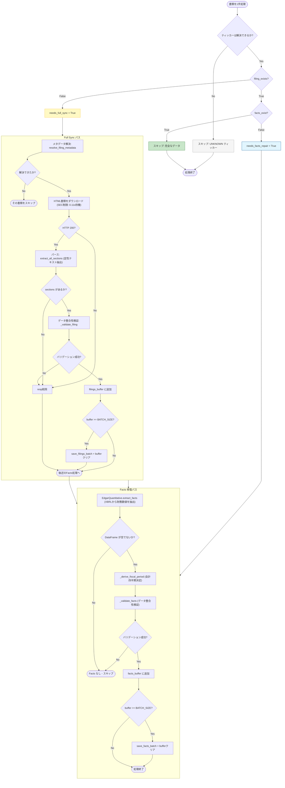
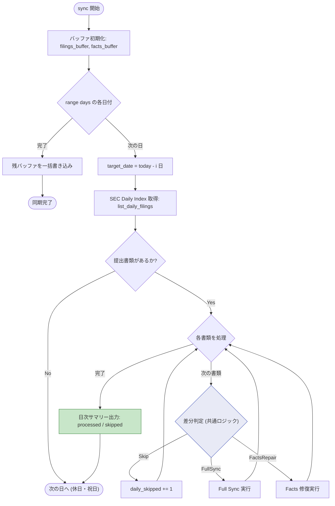
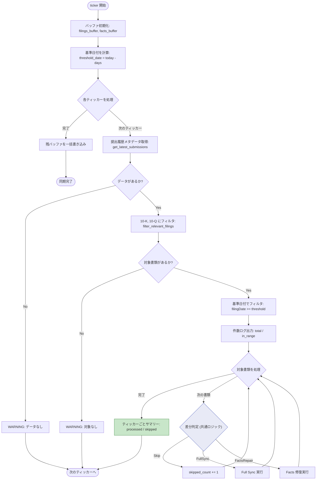
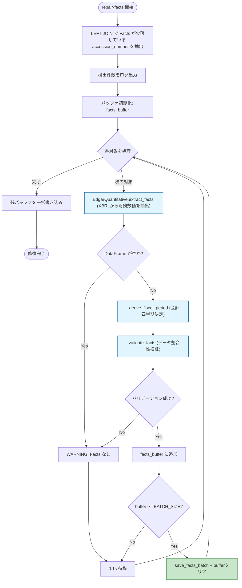

# フローチャート図 - EDGAR Sync & Repair Logic

SEC EDGAR 提出書類の差分同期・修復ロジックの全体フローを示します。
データの「完全性（Completeness）」を担保するための論理パスと、バッチ処理によるパフォーマンス最適化を含みます。

---

## 1. 全体構成

4つのエントリポイントから同一の差分判定ロジックが共有されます。

```
CLI (main.py)
  ├── sync       → sync_recent_us_filings()   # Daily Index ベルク同期
  ├── ticker     → process_us_tickers()        # ティッカー個別同期
  ├── repair-facts → repair_all_missing_facts() # 欠損Facts自動修復
  └── stats      → storage.get_stats()         # DB統計情報表示
```

---

## 2. 共通ロジック: 差分判定（Smart Repair）

`sync_recent_us_filings` と `process_us_tickers` の両方で使用される、
提出書類ごとの差分更新判定フローです。



---

## 3. sync_recent_us_filings（Daily Index ベルク同期）

SEC Daily Index を使用して、米国上場企業全体の提出書類を日単位で遡及同期します。



---

## 4. process_us_tickers（ティッカー個別同期）

指定したティッカーシンボル群について、直近の提出書類をピンポイントで同期します。



---

## 5. repair_all_missing_facts（Facts 自動修復）

データベース内の全レコードを走査し、定性データはあるが定量データ（Facts）が
欠落しているレコードを検出し、自動的に XBRL データを再抽出して修復します。



---

## 6. バッチバッファの仕組み

3つの関数すべてで共通して使用される、メモリ上的バッファリングと一括書き込みの仕組みです。

```
  処理対象 N 件
       │
       ▼
  ┌─────────────┐
  │  バッファに   │  filings_buffer: (metadata, sections)
  │  追加        │  facts_buffer: (ticker, acc_no, facts_df)
  └──────┬──────┘
         │
         ▼
  ┌─────────────────┐
  │ len(buffer) >=   │  BATCH_SIZE（.env で設定、デフォルト: 10）
  │ BATCH_SIZE ?     │
  └────┬───────┬────┘
       │ Yes   │ No
       ▼       ▼
  ┌─────────┐  ┌──────────┐
  │ 一括保存 │  │ 次の件を  │
  │ + クリア  │  │ 追加      │
  └─────────┘  └──────────┘

  処理完了後:
    残バッファが存在すれば一括保存（Final Flush）
```

---

## 7. DB テーブル構造

差分判定に使用されるテーブルとメソッドの対応です。

| メソッド | クエリ対象テーブル | 判定内容 |
|---|---|---|
| `filing_exists(acc_no)` | `filings` | 書類メタデータの存在有無 |
| `facts_exist(acc_no)` | `company_facts` | 財務数値データの存在有無 |
| `get_accession_numbers_needing_repair()` | `filings LEFT JOIN company_facts` | メタデータはあるが Facts が欠落 |

### テーブル定義

**1. `filings` テーブル**
```sql
CREATE TABLE filings (
    accession_number VARCHAR PRIMARY KEY,
    ticker VARCHAR,
    cik VARCHAR,
    form VARCHAR,           -- "10-K", "10-Q"
    filing_date DATE,
    metadata JSON,          -- SECメタデータ全体
    updated_at TIMESTAMP
);
```

**2. `filing_sections` テーブル**
```sql
CREATE TABLE filing_sections (
    section_id VARCHAR PRIMARY KEY,  -- MD5(accession_number|section_name)
    accession_number VARCHAR,
    section_name VARCHAR,
    content_md TEXT,                  -- セクション本文
    updated_at TIMESTAMP
);
```

**3. `company_facts` テーブル**
```sql
CREATE TABLE company_facts (
    fact_id VARCHAR PRIMARY KEY,  -- MD5(ticker|accession_number|concept|period_start|period_end|period_instant)
    accession_number VARCHAR,
    ticker VARCHAR,
    concept VARCHAR,              -- XBRL概念名
    label VARCHAR,
    value DOUBLE,                 -- 数値
    unit VARCHAR,
    fiscal_year INTEGER,
    fiscal_period VARCHAR,        -- "Q1", "Q2", "Q3", "Q4", "FY"
    period_start DATE,
    period_end DATE,
    period_instant DATE
);
```

### インデックス

| インデックス名 | 対象カラム | 用途 |
|---|---|---|
| `idx_edgar_facts_lookup` | (ticker, concept, period_end) | 財務データ検索用 |
| `idx_edgar_sections_lookup` | (accession_number, section_name) | セクション検索用 |

---

## 8. エラーハンドリング方針

| レベル | 方法 | 例 |
|--------|------|-----|
| ネットワークエラー | 指数バックオフリトライ | `_request_with_retry()`（max_retries=5） |
| レート制限（429） | 指数バックオフ + ランダムウェイト | `(2^attempt) + random(0,1)` |
| データ整合性エラー | `DataIntegrityError`例外 | `_validate_filing()`, `_validate_facts()` |
| 個別書類処理エラー | 例外キャッチ+ログ+continue | pipeline.py内のループ処理 |
| バッチ保存エラー | 個別キャッチ+スキップ | `save_filings_batch()`内のtry-except |
| HTTPエラー（200以外） | ダウンロードスキップ | `fetch_filing_content()` |
| メタデータ解決失敗 | その書類をスキップ | `resolve_filing_metadata()` |

### データ整合性検証

**`_validate_filing()`**: 書類メタデータとセクションの検証
- 必須フィールドチェック: `accessionNumber`, `ticker`, `form`, `filingDate`
- セクション空チェック
- テキスト量チェック: 合計100文字以上

**`_validate_facts()`**: 財務数値データの検証
- DataFrame空チェック
- 必須カラムチェック: `concept`, `numeric_value`

### SEC API制限への対応

1. **リクエスト間隔制御**
   - sync/ticker: `asyncio.sleep(0.11)` （約9リクエスト/秒）
   - repair-facts: `asyncio.sleep(0.1)` （10リクエスト/秒）

2. **User-Agent設定**（SEC規約準拠）
   ```
   USER_AGENT="edgar-provider/1.0 (contact: admin@example.com)"
   ```

---

## 9. 環境変数設定

| 変数名 | デフォルト | 説明 |
|--------|-----------|------|
| `BATCH_SIZE` | 10 | バッチバッファサイズ |
| `USER_AGENT` | "edgar-provider/1.0 (contact: admin@example.com)" | SEC User-Agent |
| `SEC_IDENTITY` | "UnknownAdmin admin@example.com" | SEC連絡先 |
| `EDGAR_DATA_DIR` | "finance/data/edgar/edgar.duckdb" | DuckDBパス |
| `DUCKDB_MEMORY_LIMIT` | 2GB | DuckDBメモリ制限 |
| `DUCKDB_THREADS` | 4 | DuckDB並列スレッド数 |
| `DUCKDB_CHECKPOINT_THRESHOLD` | 1GB | チェックポイント閾値 |
