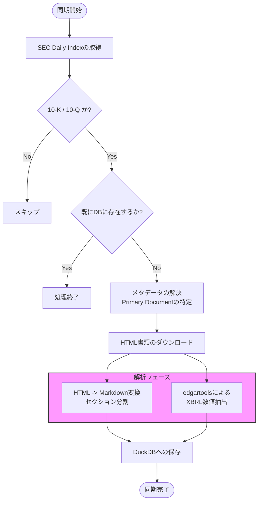

# フローチャート図 - EDGAR Sync Logic

データの発見から永続化までの論理パスを示します。

```mermaid
graph TD
    Start([同期開始]) --> GetIndex[SEC Daily Indexの取得]
    GetIndex --> FilterForms{10-K / 10-Q か?}
    
    FilterForms -- No --> Skip[スキップ]
    FilterForms -- Yes --> CheckDB{既にDBに存在するか?}

    CheckDB -- Yes --> AlreadyExists[処理終了]
    CheckDB -- No --> ResolveMeta[メタデータの解決<br/>Primary Documentの特定]

    ResolveMeta --> DownloadHTML[HTML書類のダウンロード]
    
    subgraph Analysis [解析フェーズ]
        direction TB
        ParseText[HTML -> Markdown変換<br/>セクション分割]
        ExtractFacts[edgartoolsによる<br/>XBRL数値抽出]
    end

    DownloadHTML --> ParseText
    DownloadHTML --> ExtractFacts

    ParseText --> SaveDB[DuckDBへの保存]
    ExtractFacts --> SaveDB

    SaveDB --> End([同期完了])

    style Analysis fill:#f9f,stroke:#333,stroke-width:2px
```
