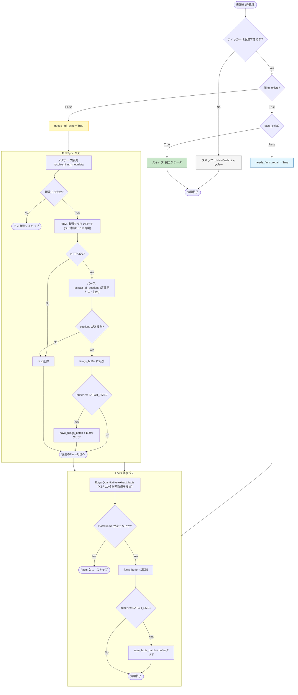
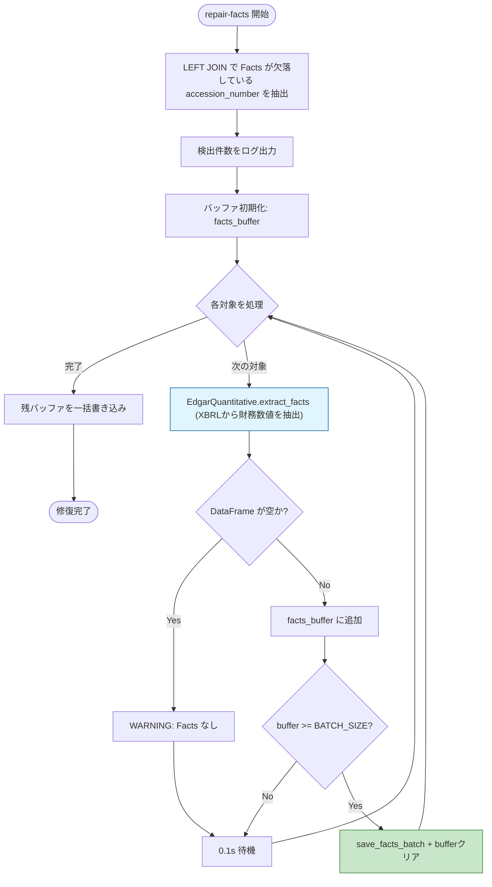

# フローチャート図 - EDGAR Sync & Repair Logic

SEC EDGAR 提出書類の差分同期・修復ロジックの全体フローを示します。
データの「完全性（Completeness）」を担保するための論理パスと、バッチ処理によるパフォーマンス最適化を含みます。

---

## 1. 全体構成

3つのエントリポイントから同一の差分判定ロジックが共有されます。

```
CLI (main.py)
  ├── sync       → sync_recent_us_filings()   # Daily Index ベルク同期
  ├── ticker     → process_us_tickers()        # ティッカー個別同期
  └── repair-facts → repair_all_missing_facts() # 欠損Facts自動修復
```

---

## 2. 共通ロジック: 差分判定（Smart Repair）

`sync_recent_us_filings` と `process_us_tickers` の両方で使用される、
提出書類ごとの差分更新判定フローです。



---

## 3. sync_recent_us_filings（Daily Index ベルク同期）

SEC Daily Index を使用して、米国上場企業全体の提出書類を日単位で遡及同期します。


---

## 4. process_us_tickers（ティッカー個別同期）

指定したティッカーシンボル群について、直近の提出書類をピンポイントで同期します。


---

## 5. repair_all_missing_facts（Facts 自動修復）

データベース内の全レコードを走査し、定性データはあるが定量データ（Facts）が
欠落しているレコードを検出し、自動的に XBRL データを再抽出して修復します。



---

## 6. バッチバッファの仕組み

3つの関数すべてで共通して使用される、メモリ上的バッファリングと一括書き込みの仕組みです。

```
  処理対象 N 件
       │
       ▼
  ┌─────────────┐
  │  バッファに   │  filings_buffer: (metadata, sections)
  │  追加        │  facts_buffer: (ticker, acc_no, facts_df)
  └──────┬──────┘
         │
         ▼
  ┌─────────────────┐
  │ len(buffer) >=   │  BATCH_SIZE（.env で設定、デフォルト: 10）
  │ BATCH_SIZE ?     │
  └────┬───────┬────┘
       │ Yes   │ No
       ▼       ▼
  ┌─────────┐  ┌──────────┐
  │ 一括保存 │  │ 次の件を  │
  │ + クリア  │  │ 追加      │
  └─────────┘  └──────────┘

  処理完了後:
    残バッファが存在すれば一括保存（Final Flush）
```

---

## 7. DB テーブル構造

差分判定に使用されるテーブルとメソッドの対応です。

| メソッド | クエリ対象テーブル | 判定内容 |
|---|---|---|
| `filing_exists(acc_no)` | `filings` | 書類メタデータの存在有無 |
| `facts_exist(acc_no)` | `company_facts` | 財務数値データの存在有無 |
| `get_accession_numbers_needing_repair()` | `filings LEFT JOIN company_facts` | メタデータはあるが Facts が欠落 |

---

## 8. エラーハンドリング方針

- **個別書類の例外**: `try/except` で catching し、ログ出力後に次の書類へ処理を継続
- **日付単位の例外**: `try/except` で catching し、ログ出力後に次の日付へ処理を継続
- **SEC レート制限**: `asyncio.sleep(0.11)` で1秒10リクエストを遵守
- **HTTP エラー**: ステータスコードが 200 以外の場合、ダウンロードをスキップ
- **メタデータ解決失敗**: `resolve_filing_metadata` が `None` を返した場合、その書類をスキップ
