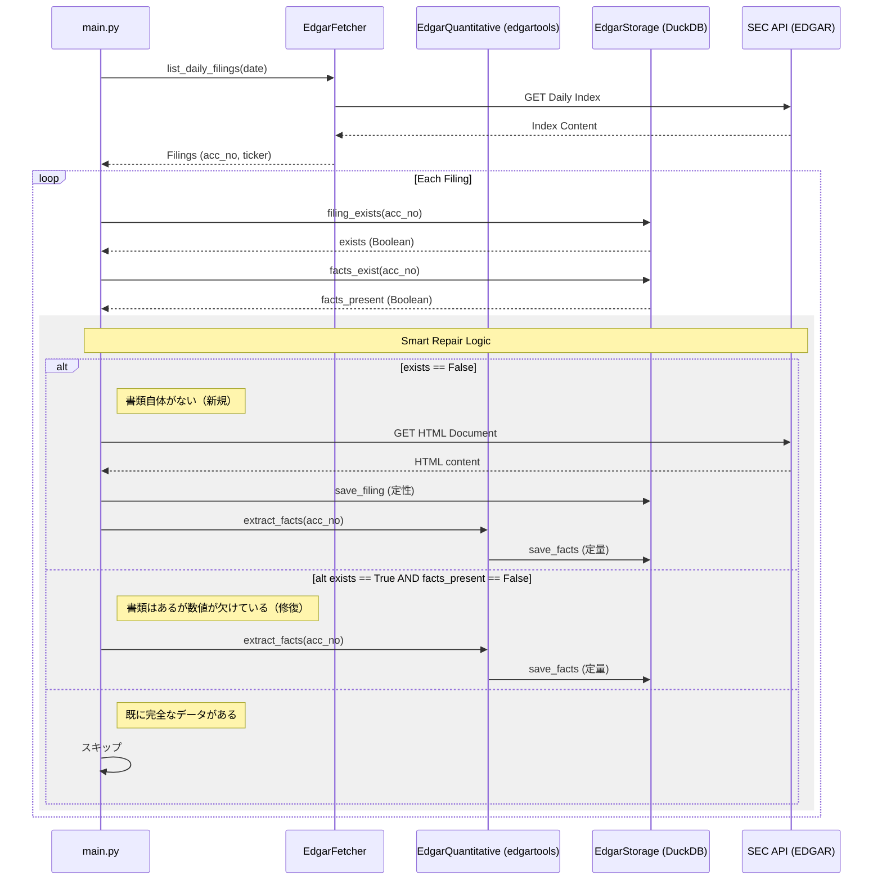

# シーケンス図 - EDGAR Data Pipeline (Completeness-Aware)

この図は、一つの提出書類（Filing）が発見されてから、定性・定量データの「完全性」を考慮して保存・修復されるまでの流れを示します。

```mermaid
sequenceDiagram
    participant CLI as main.py
    participant F as EdgarFetcher
    participant Q as EdgarQuantitative (edgartools)
    participant S as EdgarStorage (DuckDB)
    participant SEC as SEC API (EDGAR)

    CLI->>F: list_daily_filings(date)
    F->>SEC: GET Daily Index
    SEC-->>F: Index Content
    F-->>CLI: Filings (acc_no, ticker)

    loop Each Filing
        CLI->>S: filing_exists(acc_no)
        S-->>CLI: exists (Boolean)
        CLI->>S: facts_exist(acc_no)
        S-->>CLI: facts_present (Boolean)

        rect rgb(240, 240, 240)
            Note over CLI, SEC: Smart Repair Logic
            
            alt exists == False
                Note right of CLI: 書類自体がない（新規）
                CLI->>SEC: GET HTML Document
                SEC-->>CLI: HTML content
                CLI->>S: save_filing (定性)
                CLI->>Q: extract_facts(acc_no)
                Q->>S: save_facts (定量)
            else alt exists == True AND facts_present == False
                Note right of CLI: 書類はあるが数値が欠けている（修復）
                CLI->>Q: extract_facts(acc_no)
                Q->>S: save_facts (定量)
            else
                Note right of CLI: 既に完全なデータがある
                CLI->>CLI: スキップ
            end
        end
    end
```
