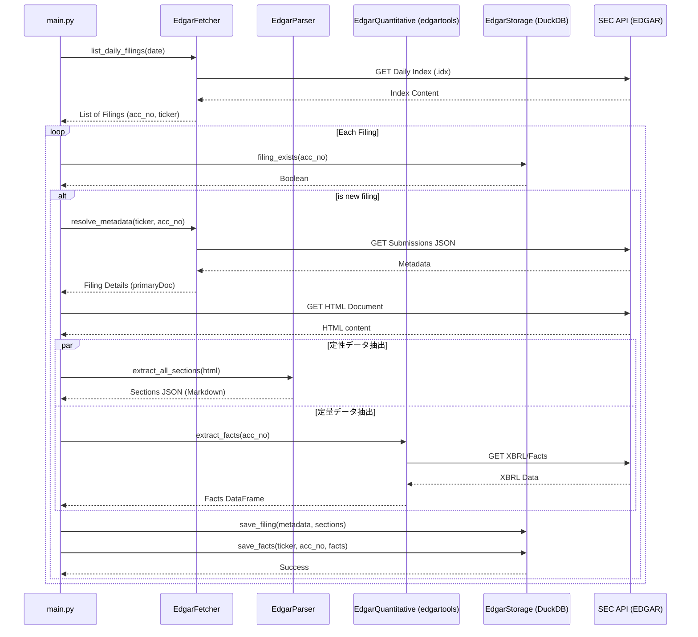

# シーケンス図 - EDGAR Data Pipeline

この図は、一つの提出書類（Filing）が発見されてから、定性・定量データとして保存されるまでの流れを示します。

```mermaid
sequenceDiagram
    participant CLI as main.py
    participant F as EdgarFetcher
    participant P as EdgarParser
    participant Q as EdgarQuantitative (edgartools)
    participant S as EdgarStorage (DuckDB)
    participant SEC as SEC API (EDGAR)

    CLI->>F: list_daily_filings(date)
    F->>SEC: GET Daily Index (.idx)
    SEC-->>F: Index Content
    F-->>CLI: List of Filings (acc_no, ticker)

    loop Each Filing
        CLI->>S: filing_exists(acc_no)
        S-->>CLI: Boolean

        alt is new filing
            CLI->>F: resolve_metadata(ticker, acc_no)
            F->>SEC: GET Submissions JSON
            SEC-->>F: Metadata
            F-->>CLI: Filing Details (primaryDoc)

            CLI->>SEC: GET HTML Document
            SEC-->>CLI: HTML content

            par 定性データ抽出
                CLI->>P: extract_all_sections(html)
                P-->>CLI: Sections JSON (Markdown)
            and 定量データ抽出
                CLI->>Q: extract_facts(acc_no)
                Q->>SEC: GET XBRL/Facts
                SEC-->>Q: XBRL Data
                Q-->>CLI: Facts DataFrame
            end

            CLI->>S: save_filing(metadata, sections)
            CLI->>S: save_facts(ticker, acc_no, facts)
            S-->>CLI: Success
        end
    end
```
