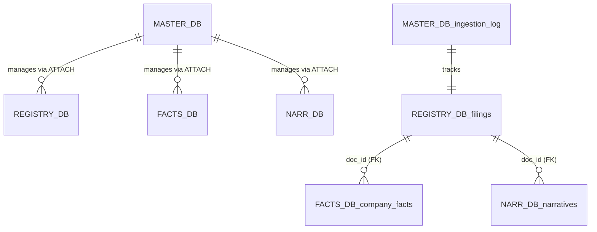

# EDINET Provider Database Governance Documentation
*Last Updated: 2026-05-06 21:33:56*

## 1. Governance Model: The Quad-Split
The system adheres to a **Local-First Financial Data Infrastructure** pattern. It separates concerns across four physical storage shards to optimize for scalability, compression, and specialized access patterns.

### Database Relationship Architecture


## 2. Reliability Layer (Data Contracts)
All ingestion is validated against Pydantic models defined in `src/core/contracts.py`. This ensures type safety and ticker normalization before data hits the storage layer.

## 3. Data Dictionary

### Shard: `master`
> Master Control Database - State Management & Governance

#### Table: `schema_version`
**Description**: Migration tracking for all database shards

| Column | Type | Constraints |
| :--- | :--- | :--- |
| `version` | `INTEGER` | PRIMARY KEY |
| `applied_at` | `TIMESTAMP` | DEFAULT CURRENT_TIMESTAMP |

<details><summary>View Raw DDL</summary>

```sql
CREATE TABLE IF NOT EXISTS schema_version (
                        version INTEGER PRIMARY KEY,
                        applied_at TIMESTAMP DEFAULT CURRENT_TIMESTAMP
                    )
```
</details>

#### Table: `ingestion_log`
**Description**: Tracks sync status and self-healing progress

| Column | Type | Constraints |
| :--- | :--- | :--- |
| `doc_id` | `VARCHAR` | PRIMARY KEY |
| `status` | `VARCHAR` | NOT NULL |
| `--` | `'PENDING'` |  |
| `'PARTIAL_FAIL'` | `last_attempt` | TIMESTAMP NOT NULL |
| `retry_count` | `INTEGER` | DEFAULT 0 |
| `error_message` | `TEXT` |  |

<details><summary>View Raw DDL</summary>

```sql
CREATE TABLE IF NOT EXISTS ingestion_log (
                        doc_id VARCHAR PRIMARY KEY,
                        status VARCHAR NOT NULL, -- 'PENDING', 'SUCCESS', 'PARTIAL_FAIL'
                        last_attempt TIMESTAMP NOT NULL,
                        retry_count INTEGER DEFAULT 0,
                        error_message TEXT
                    )
```
</details>

### Shard: `registry_db`
> Registry Database - Document Catalog & Metadata

#### Table: `filings`
**Description**: Metadata for every filed document
**Data Contract**: `FilingMetadata`

| Column | Type | Constraints |
| :--- | :--- | :--- |
| `doc_id` | `VARCHAR` | PRIMARY KEY |
| `edinet_code` | `VARCHAR` | NOT NULL |
| `sec_code` | `VARCHAR` |  |
| `--` | `Normalized` | 4-digit code filer_name VARCHAR NOT NULL |
| `doc_description` | `VARCHAR` |  |
| `submit_datetime` | `TIMESTAMP` | NOT NULL |
| `form_code` | `VARCHAR` |  |
| `doc_type_code` | `VARCHAR` |  |
| `session_id` | `VARCHAR` | NOT NULL |
| `ingested_at` | `TIMESTAMP` | DEFAULT CURRENT_TIMESTAMP |

<details><summary>View Raw DDL</summary>

```sql
CREATE TABLE IF NOT EXISTS filings (
                        doc_id VARCHAR PRIMARY KEY,
                        edinet_code VARCHAR NOT NULL,
                        sec_code VARCHAR, -- Normalized 4-digit code
                        filer_name VARCHAR NOT NULL,
                        doc_description VARCHAR,
                        submit_datetime TIMESTAMP NOT NULL,
                        form_code VARCHAR,
                        doc_type_code VARCHAR,
                        session_id VARCHAR NOT NULL,
                        ingested_at TIMESTAMP DEFAULT CURRENT_TIMESTAMP
                    )
```
</details>

### Shard: `facts_db`
> Facts Database - Numerical Financial Data

#### Table: `company_facts`
**Description**: Parsed numerical facts (Type 5 CSV) mapped to standard items
**Data Contract**: `CompanyFact`

| Column | Type | Constraints |
| :--- | :--- | :--- |
| `doc_id` | `VARCHAR` | NOT NULL |
| `item_name` | `VARCHAR` | NOT NULL |
| `item_value` | `DOUBLE` |  |
| `unit` | `VARCHAR` |  |
| `context_id` | `VARCHAR` | NOT NULL |
| `fiscal_year` | `INTEGER` |  |
| `fiscal_period` | `VARCHAR` |  |
| `session_id` | `VARCHAR` | NOT NULL |
| `ingested_at` | `TIMESTAMP` | DEFAULT CURRENT_TIMESTAMP |

<details><summary>View Raw DDL</summary>

```sql
CREATE TABLE IF NOT EXISTS company_facts (
                        doc_id VARCHAR NOT NULL,
                        item_name VARCHAR NOT NULL,
                        item_value DOUBLE,
                        unit VARCHAR,
                        context_id VARCHAR NOT NULL,
                        fiscal_year INTEGER,
                        fiscal_period VARCHAR,
                        session_id VARCHAR NOT NULL,
                        ingested_at TIMESTAMP DEFAULT CURRENT_TIMESTAMP,
                        PRIMARY KEY (doc_id, item_name, context_id)
                    )
```
</details>

### Shard: `narr_db`
> Narratives Database - Unstructured Text Storage

#### Table: `narratives`
**Description**: Extracted text blocks (Business Risks, etc.) using ZSTD compression
**Data Contract**: `NarrativeBlock`

| Column | Type | Constraints |
| :--- | :--- | :--- |
| `doc_id` | `VARCHAR` | NOT NULL |
| `section_name` | `VARCHAR` | NOT NULL |
| `content_md` | `VARCHAR` | NOT NULL |
| `session_id` | `VARCHAR` | NOT NULL |
| `ingested_at` | `TIMESTAMP` | DEFAULT CURRENT_TIMESTAMP |

<details><summary>View Raw DDL</summary>

```sql
CREATE TABLE IF NOT EXISTS narratives (
                        doc_id VARCHAR NOT NULL,
                        section_name VARCHAR NOT NULL,
                        content_md VARCHAR NOT NULL,
                        session_id VARCHAR NOT NULL,
                        ingested_at TIMESTAMP DEFAULT CURRENT_TIMESTAMP,
                        PRIMARY KEY (doc_id, section_name)
                    )
```
</details>

## 4. Lifecycle Management
Database migrations are handled by the `MigrationManager` (Master-led). It synchronizes the SSoT schema and applies incremental SQL files from the `migrations/` directory.